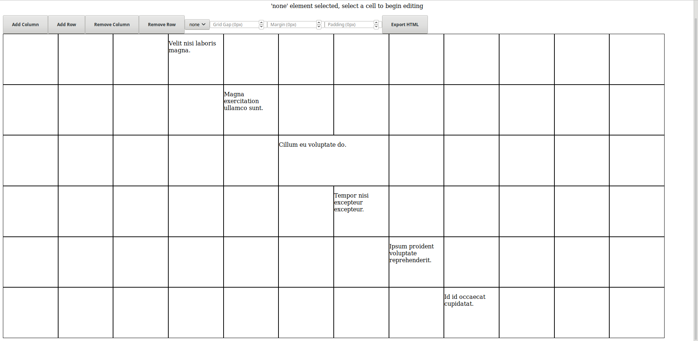
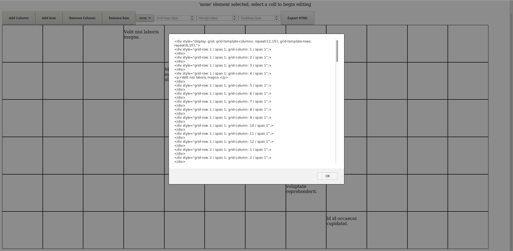
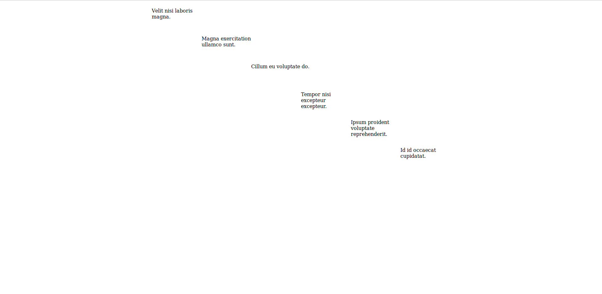

# html-grid-template-generator
An interactive html grid generator. No more worrying about span, this generator handles the creation of a grid and placing elements interactively.

## Link (v1)
https://html-grid-template-generator.firebaseapp.com/

## Functionality (v1)
1) Add/Remove rows and columns.
2) Merge neighbouring cells.
3) Add/Remove editable text elements (p,h1,h2,h3,h4,h5) to cells.
4) Adjust gridGap, margin and padding.
5) Export HTML div element with inner divs representing the cells. All styles are inline. Currently clicking Export HTML will alert you of the markup which you can copy.

## Upcoming functionality (v2)
1) Undo/Redo all actions to allow more freedom.
2) Optimizing HTML generation for only cells that are used.
3) More elements i.e. img

## About
This app runs in the browser thanks to the parcel package which bundles all the scripts specified in the entry point index.html file.